Customer churn prediction report - 

Screenshots or output showing:
Data exploration and preprocessing - 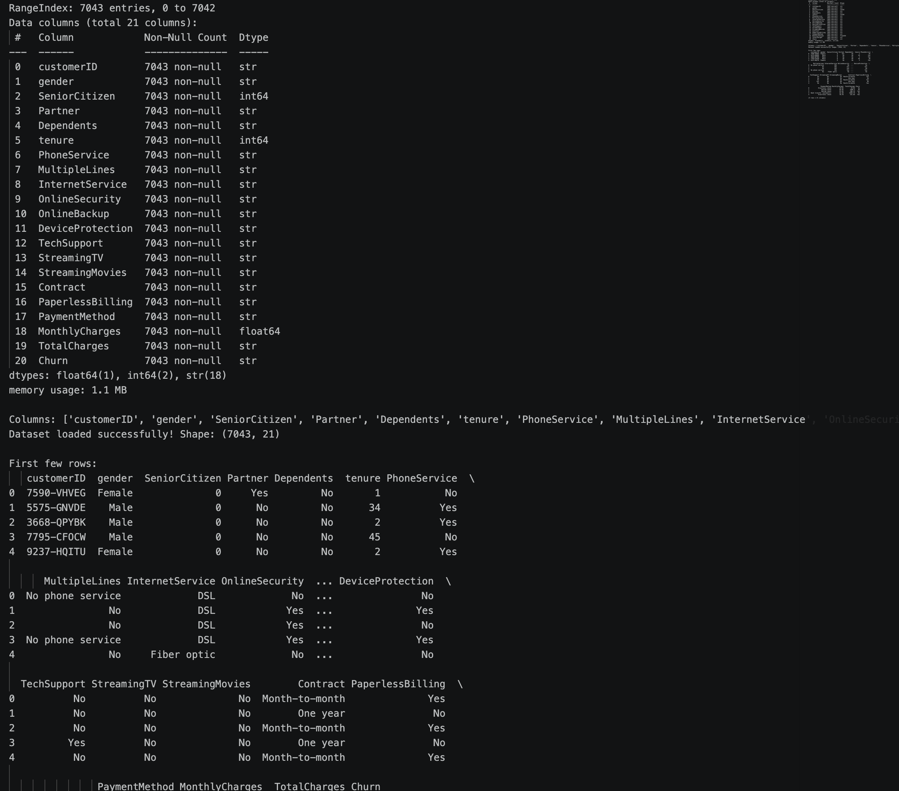, 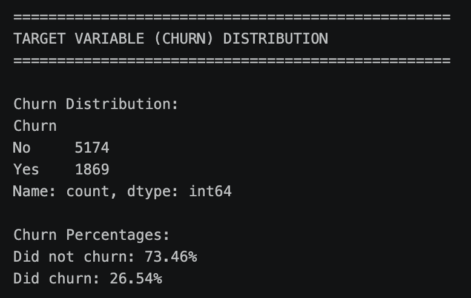, 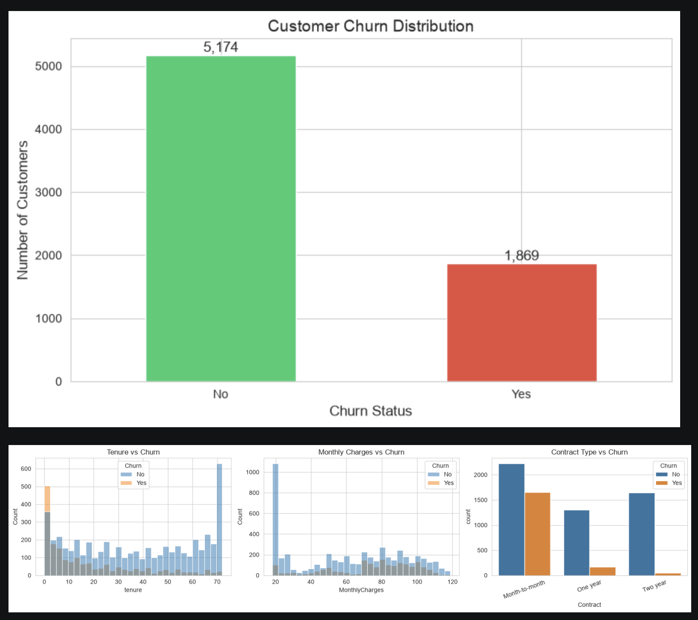
Data processing - 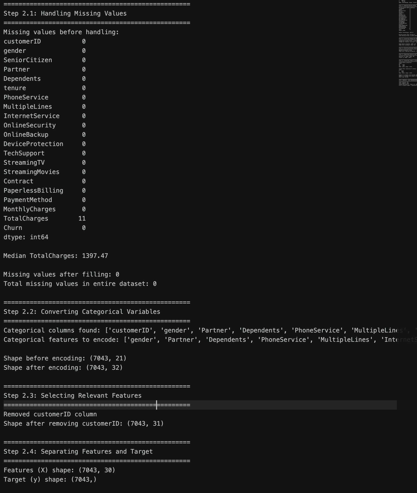, 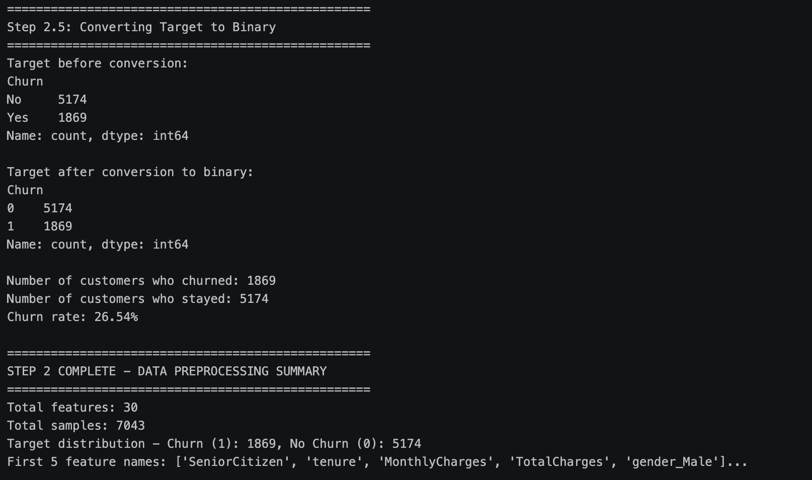
Model training and evaluation - 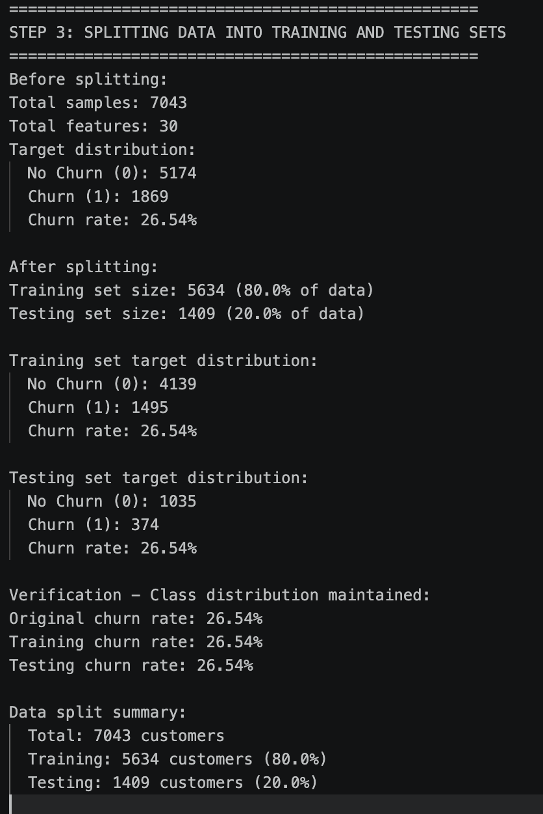, 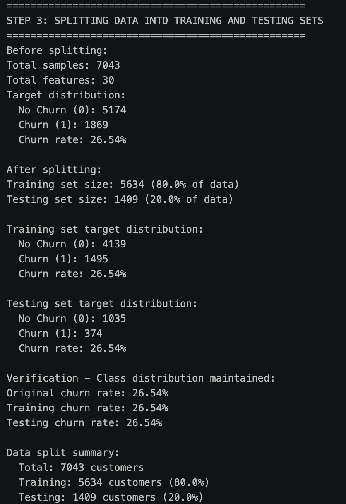, 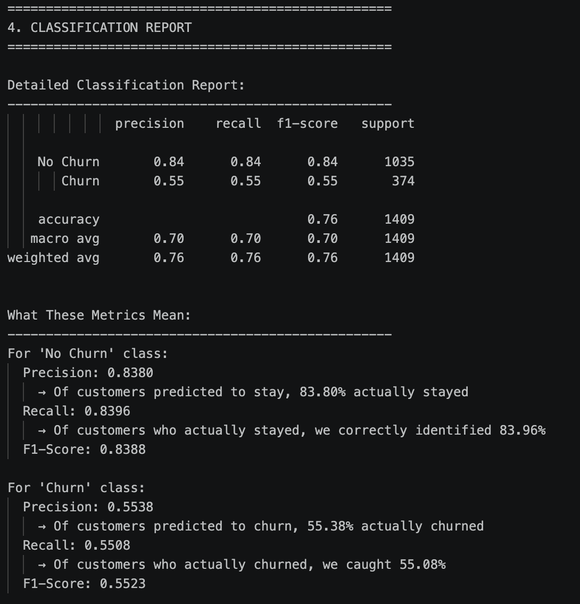, 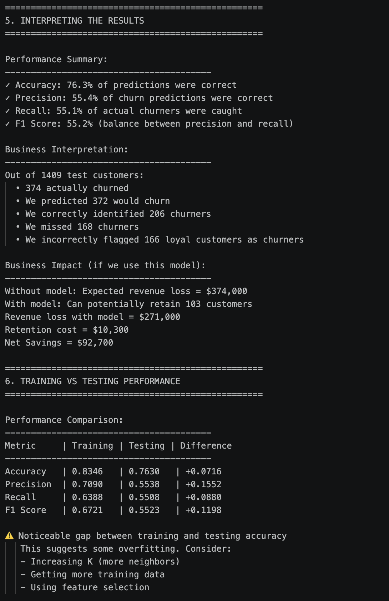, 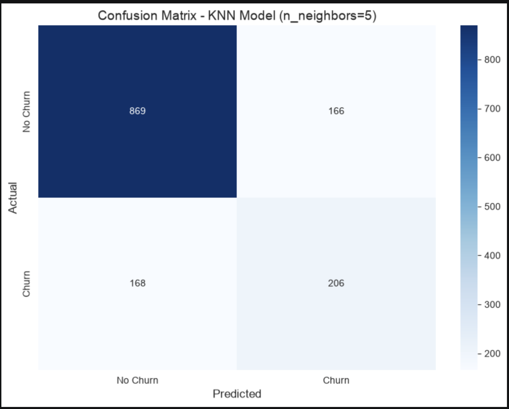
Comparison of different K values - 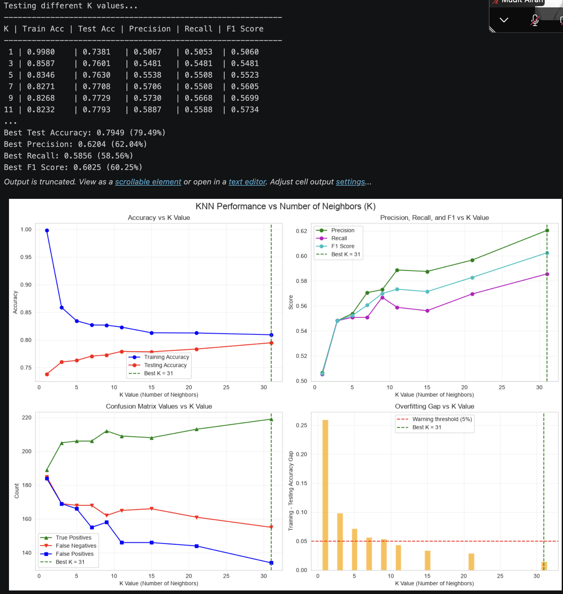, 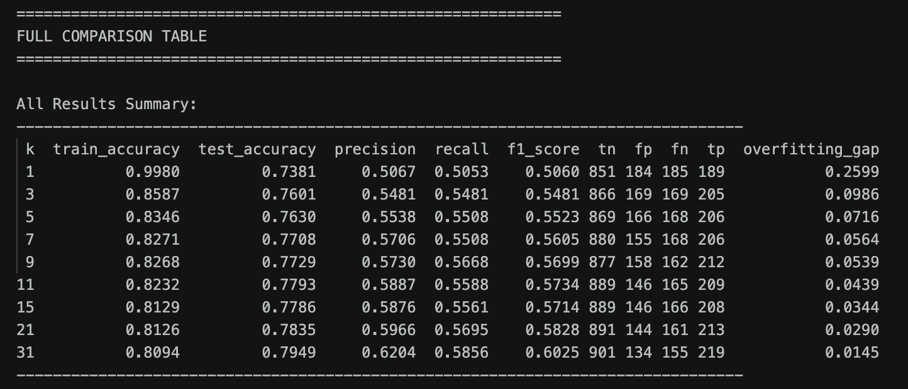, 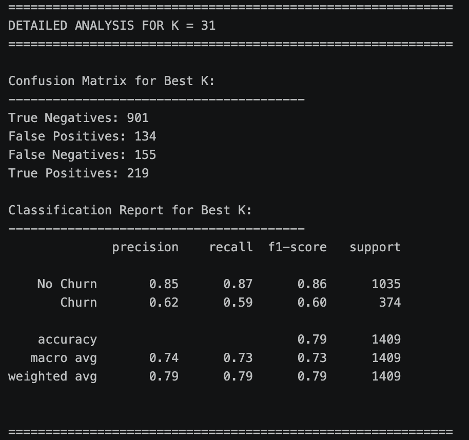

A brief report (1-2 pages) including:
What is the model's accuracy?
The KNN model with K=31 achieved 79.49% accuracy on the test data, correctly predicting customer churn status for about 4 out of 5 customers. More importantly, it has 62.04% precision (when it predicts churn, it's correct 62% of the time) and 58.56% recall (it catches about 59% of actual churners), with an F1 score of 60.25% balancing both metrics effectively.

What features seem most important?
Contract type is the strongest predictor - month-to-month customers consistently show much higher churn rates than those on one-year or two-year contracts. Customer tenure is equally critical, with new customers (under 12 months) being far more likely to churn than long-term customers. Additionally, customers with fiber optic internet, higher monthly charges, no online security, and no tech support consistently show higher churn rates across all customer segments.

What would you recommend to the company based on your model?
Priority #1: Launch a targeted campaign to convert month-to-month customers to annual contracts by offering discounts, free service upgrades, or loyalty bonuses, as this single intervention addresses the strongest churn predictor in your data. 
Priority #2: Implement a proactive retention program focused on customers in their first 12 months with personalized onboarding, regular check-ins, and early loyalty incentives to build engagement before the critical churn window closes. 
Priority #3: Address service quality issues by investigating why fiber optic customers churn more frequently and consider bundling online security and tech support as retention incentives for at-risk customers.

What are the limitations of your model?
The model only predicts probability of churn but doesn't explain why customers leave, missing external factors like competitor offers, pricing changes, or life events that could trigger churn. It also has 134 false positives (customers incorrectly flagged as churn risks) and 155 false negatives (missed actual churners), meaning some retention resources will be wasted while some at-risk customers go unnoticed. Additionally, the model was trained on historical data and requires regular updates with new customer information to maintain accuracy as customer behavior patterns evolve over time.

Summary of Your Approach - 
Built a K-Nearest Neighbors (KNN) classification model to predict customer churn by loading and exploring the Telco Customer Churn dataset, preprocessing the data (handling missing values, one-hot encoding categorical variables, and scaling numerical features), and splitting it into training and testing sets. Experimented with different K values from 1 to 31, evaluating each model's performance using accuracy, precision, recall, F1 score, and overfitting gap, ultimately selecting K=31 as the optimal model based on its superior test accuracy and generalization.

Model Performance Metrics - 
The final KNN model with K=31 achieved 79.49% accuracy, 62.04% precision, 58.56% recall, and an F1 score of 60.25% on the test data, with a confusion matrix showing 901 true negatives, 134 false positives, 155 false negatives, and 219 true positives. The model shows excellent generalization with only a 1.45% gap between training and testing accuracy, indicating it learns genuine patterns without overfitting to the training data.

Key Findings About Customer Churn - 
Contract type is the strongest predictor - month-to-month customers consistently churn at much higher rates than those with one-year or two-year contracts, while customer tenure is equally critical, with new customers (under 12 months) being far more likely to leave than long-term customers. Additional key factors include fiber optic internet service showing higher churn rates, higher monthly charges correlating with increased churn, and customers without online security or tech support being more likely to churn, suggesting service quality and perceived value strongly influence customer retention.

Limitations and Future Improvements - 
The model only predicts churn probability without explaining why customers leave, missing external factors like competitor offers, economic conditions, or life events, and it has 134 false positives and 155 false negatives, meaning resources may be wasted on loyal customers while some at-risk customers are overlooked. Future improvements could include: trying more advanced algorithms like Random Forest or XGBoost for potentially better performance, adding external data sources (customer satisfaction surveys, competitor pricing, support ticket history), engineering new features (average monthly usage, number of support calls, payment history patterns), and implementing regular model retraining with fresh data to maintain accuracy as customer behavior evolves.
